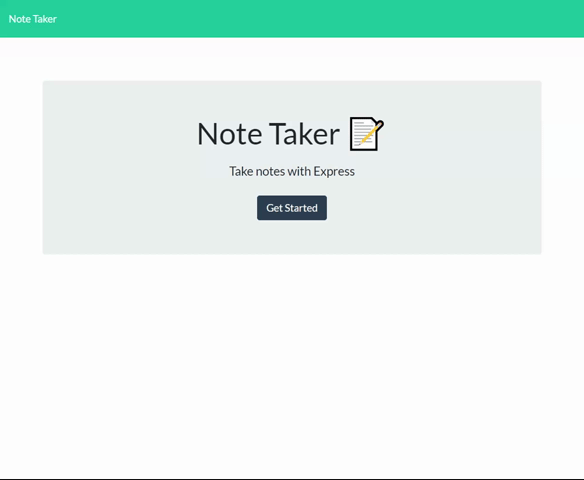

## Note Taker

## Table Of Contents

- [Description](#description)
- [Challenges](#challenges)
- [Repository URL](#repository-URL)
- [Project URL](#project-URL)
- [Project Glimpse](#Project-Glimpse)
- [Credits](#credits)
- [License](#license)

## Description

Note Taker is a project that uses NodeJS and modules Express, File System and UID. The application is hosted on Heroku. It allows the user to enter and save notes which can be re-displayed by clicking on the note title. The user can also erase each note as they choose.

## Challenges

This was my first application that required a server and custom built API's. The most challenging part for me was getting the folder structure and url pathways correct.

## Repository URL

[Repository Link](https://github.com/chadclark1234/Note-Taker)

## Project URL

[Project Link](https://notetakerapinodejs.herokuapp.com/)

## Project Glimpse

## Credits

NA

## License

NA
